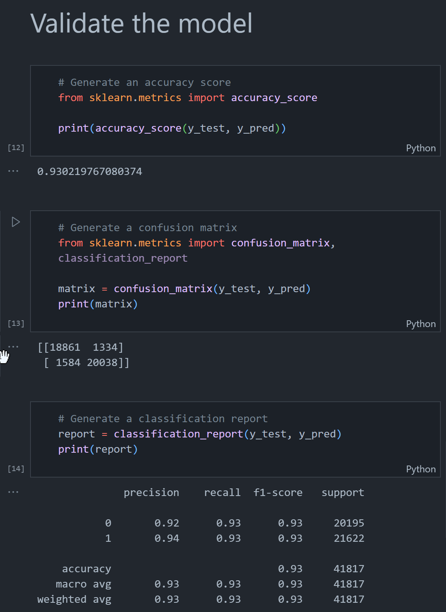

# Module 21: Final Project

## Topic

My topic is walkability and walkable neighborhoods. I chose this topic because I've lived in a lot of walkable areas throughout my adult life and have become and advocate of walkable neighborhoods and smart growth strategies. What is the definiton of walkable? According to the the EPA's *National Walkability Index Methodology and User Guide*:

> The definition of walkability is simple: a walkable place is easy to walk around.

That's easy enough; but to get into more detail, walkable neighborhoods:

* Make it easier to walk to stores, jobs, and other places while encouraging more physical activity;
* The benefits of walkable neighborhoods on an individual level scale up to improvements in overall public health;
* Enable people to leave their cars behind, which can reduce pollution and improve human and environmental health;
* Allow for more conservation of natural resources and reduce infrastructure costs;
* Encourage social interaction, building a sense of community which has been shown to help with myriad mental health issues.

The ability to predict whether a neighborhood is likely a walkable neighborhood could assist people interested in living in those types of environments find a place to live when they are, for example, moving to a new city.

## Research Question

* Is it possible to predict whether a neighborhood is walkable utilizing a machine learning algorithm?

## Data

* National Walkability Index
    * Organization: U.S. Environmental Protection Agency, Office of Sustainable Communities
    * Publication date: May 13, 2021
    * The Index measures the relative walkability of communities in the USA at the block group level

## Exploratory Data Analysis

### Tools

* Python
* Pandas
* sklearn
* Jupyter Notebook
* VS Code
* Tableau

I followed the three-phase process presented in Module 4 of the bootcamp:

### Collect the data

I conducted internet search to locate my data set. I began searching on Data.gov and discovered the [National Walkability Index](https://catalog.data.gov/dataset/walkability-index) produced by the Environmental Protection Agency. I proceeded to download the data from the relevant website.

### Prepare the data

* Imported Pandas library and read in CSV file to Dataframe
* Dropped null values
* Dropped unnecessary columns
* Exported clean Dataframe to new CSV file

### Analyze the data

* Imported necessary dependencies
* Read in data from CSV
* Encoded target field
* Separated Features from Target
* Split data into training and testing groups
* Instantiated a logistic regression model
* Fit the model using training data
* Made predictions
* Validated the model with accuracy score, confusion matrix, and classification report (output below):

## Dashboard

[The United States of Walkability](https://public.tableau.com/app/profile/benjamin.prentice/viz/TheUnitedStatesofWalkability/TheUnitedStatesofWalkability)

## Results

The machine learning model ended up producing accuracy, precision, and recall scores above .90, which is very high. Further investigation revealed some oversights:

* The data needed further preprocessing
* The data was not normalized

The accuracy, precision, and recall scores are likely unreliable due to the above.

The PostgreSQL database was created locally in pgAdmin, but could have been hosted in AWS. Though there were two tables in the database, only one was used in the analysis and it was actually a CSV file that was used to read in data and not the table in the database.

As far as the dashboard, there were adjustments that could have been made to make it more engaging. For instance, the map of Core-Based Statistical Areas (CBSAs) showing number of walkable block groups in each could have been symbolized by the count of walkable block groups. This would have allowed a user to see which CBSAs had more walkable block groups at a glance.